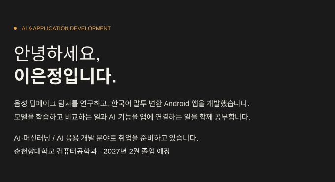
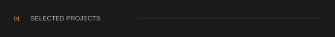
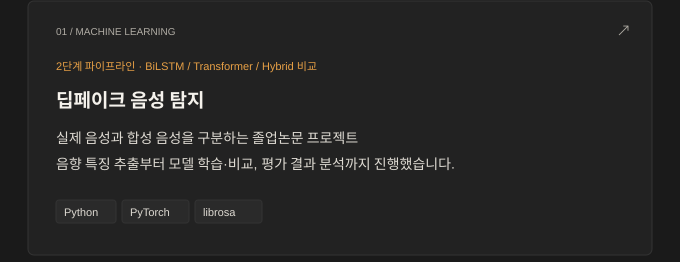
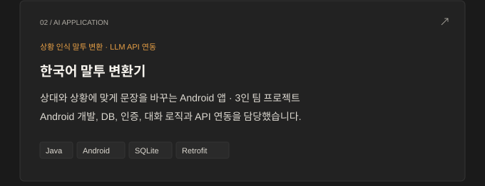
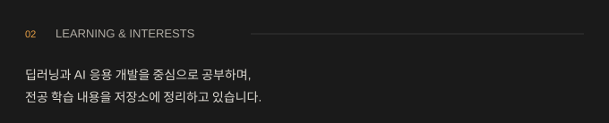
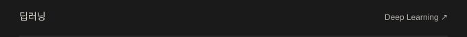
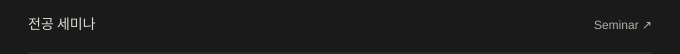
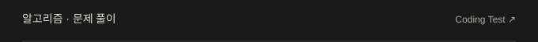
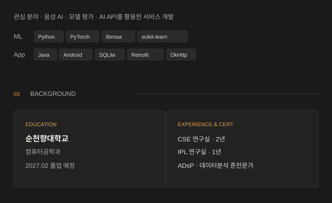
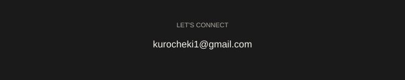

<!-- Design adapted from the HTML supplied by Eunjung Lee. SVG sections preserve the reference colors in GitHub light and dark themes. -->

 
<a href="#projects">Projects</a> · <a href="#learning">Learning</a> · <a href="#background">Background</a> · <a href="mailto:kurocheki1@gmail.com">Contact</a>  

 
 
 

 
 
 
 

 

