  

  <a href="https://github.com/Roooselina/Capstone-Project">딥페이크 음성 탐지</a> &nbsp;·&nbsp;
  <a href="https://github.com/Roooselina/Mobile-Application-Programming">한국어 말투 변환기</a>

  <a href="https://github.com/Roooselina/Deep_Learning">Deep Learning</a> &nbsp;·&nbsp;
  <a href="https://github.com/Roooselina/SEMINAR_SCH_UNIV">Seminar</a> &nbsp;·&nbsp;
  <a href="https://github.com/Roooselina/CSLab2025_CodingTest">Coding Test</a> &nbsp;·&nbsp;
  <a href="mailto:kurocheki1@gmail.com">Contact</a>

 

<h3 align="center">🛠 Tools 🛠</h3>

  &nbsp;
  &nbsp;
  

 

  &nbsp;
  

 

  &nbsp;
  

 
