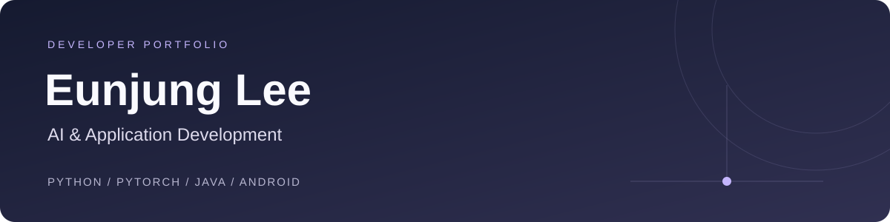

  

  <a href="#projects">Projects</a> &nbsp;·&nbsp;
  <a href="#learning">Learning</a> &nbsp;·&nbsp;
  <a href="#background">Background</a> &nbsp;·&nbsp;
  <a href="mailto:kurocheki1@gmail.com">Contact</a>

 

### 안녕하세요, 이은정입니다.

음성 딥페이크 탐지를 연구하고, 한국어 말투 변환 Android 앱을 개발했습니다.  
모델을 학습하고 비교하는 일과 AI 기능을 앱에 연결하는 일을 함께 공부하고 있습니다.

**AI·머신러닝 / AI 응용 개발** 분야로 취업을 준비하고 있습니다.  
순천향대학교 컴퓨터공학과 · **2027년 2월 졸업 예정**

 

<h2 id="projects">Selected projects</h2>

<table>
<tr>
<td width="50%" valign="top">
01 &nbsp; / &nbsp; MACHINE LEARNING
<h3><a href="https://github.com/Roooselina/Capstone-Project">딥페이크 음성 탐지 ↗</a></h3>

실제 음성과 합성 음성을 구분하는 졸업논문 프로젝트

음향 특징 추출부터 모델 학습·비교, 평가 결과 분석까지 진행했습니다.

<code>Python</code> <code>PyTorch</code> <code>librosa</code>

</td>
<td width="50%" valign="top">
02 &nbsp; / &nbsp; AI APPLICATION
<h3><a href="https://github.com/Roooselina/Mobile-Application-Programming">한국어 말투 변환기 ↗</a></h3>

상대와 상황에 맞게 문장을 바꾸는 Android 앱 · 3인 팀 프로젝트

Android 개발, DB, 인증, 대화 로직과 API 연동을 담당했습니다.

<code>Java</code> <code>Android</code> <code>SQLite</code> <code>Retrofit</code>

</td>
</tr>
</table>

 

<h2 id="learning">Learning & interests</h2>

딥러닝과 AI 응용 개발을 중심으로 공부하며, 전공 학습 내용을 저장소에 정리하고 있습니다.

| 분야 | 학습 기록 |
| :--- | :--- |
| 딥러닝 | [Deep Learning](https://github.com/Roooselina/Deep_Learning) |
| 전공 세미나 | [Seminar](https://github.com/Roooselina/SEMINAR_SCH_UNIV) |
| 알고리즘 · 문제 풀이 | [Coding Test](https://github.com/Roooselina/CSLab2025_CodingTest) |

**관심 분야** &nbsp; 음성 AI · 모델 평가 · AI API를 활용한 서비스 개발

 

### Tools I've used

**ML** &nbsp; `Python` `PyTorch` `librosa` `scikit-learn`  
**Application** &nbsp; `Java` `Android` `SQLite` `Retrofit` `OkHttp`

 

<h2 id="background">Background</h2>

| 학력 | 활동 · 자격 |
| :--- | :--- |
| **순천향대학교 컴퓨터공학과** Soonchunhyang University 2027.02 졸업 예정 | CSE 연구실 · 2년 IPL 연구실 · 1년 ADsP · 데이터분석 준전문가 |

 

  <b>Let's connect</b> 
  <a href="mailto:kurocheki1@gmail.com">kurocheki1@gmail.com</a>

